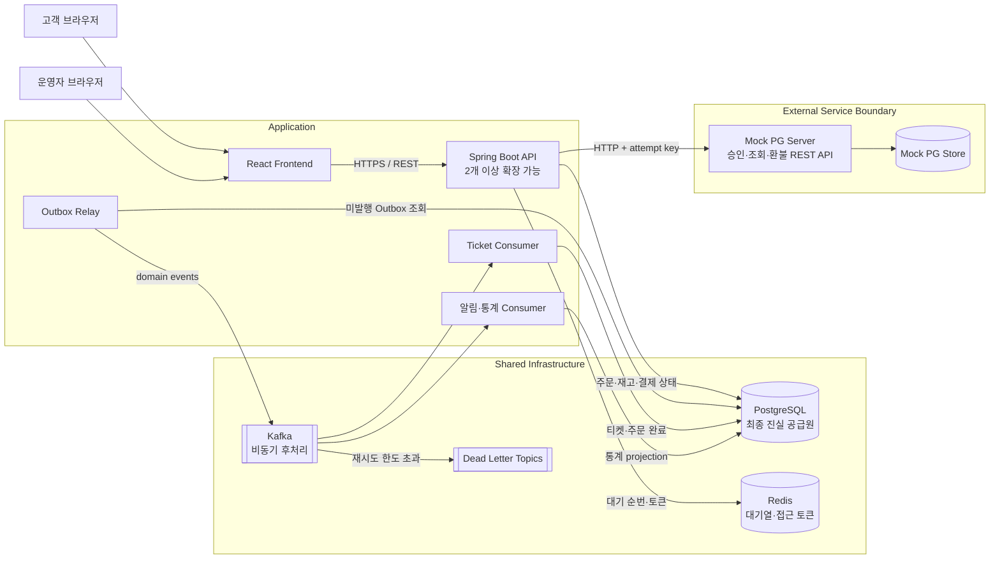
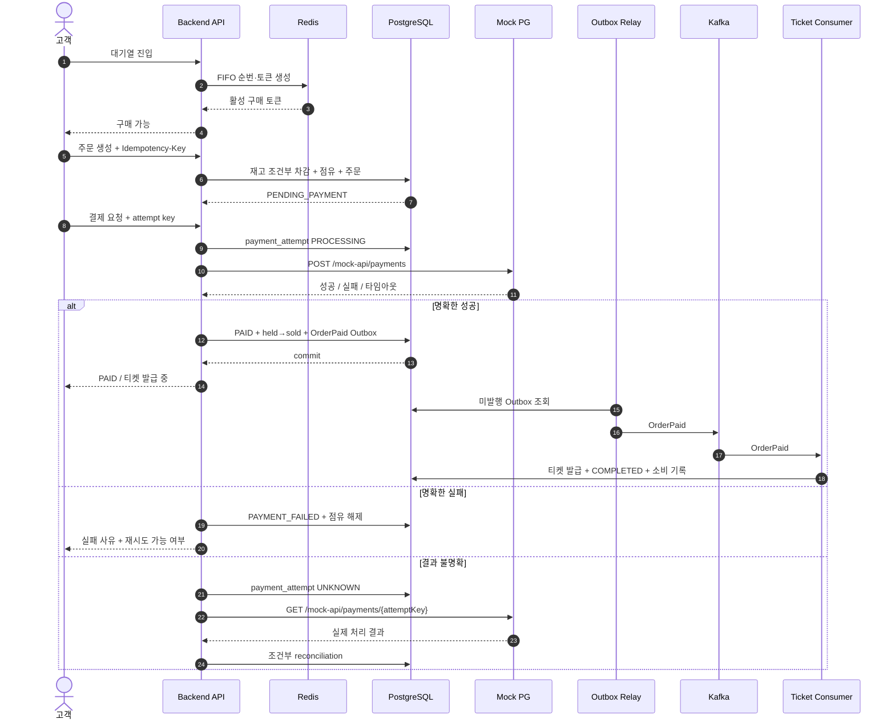
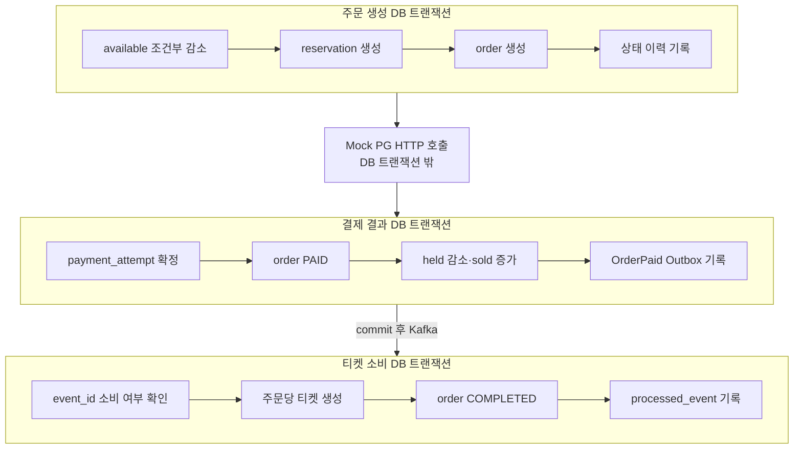
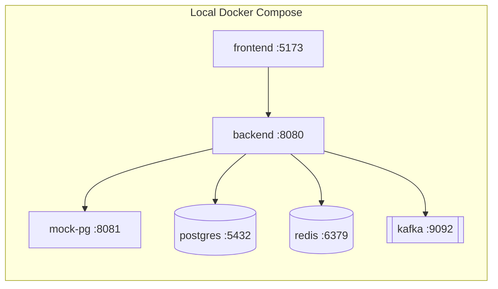

# 시스템 아키텍처

이 문서는 페스타 티켓 판매 시스템의 구성 요소, 데이터 소유권, 핵심 처리 흐름을 한눈에 설명한다. 세부 구현 순서와 검증 기준은 [IMPLEMENTATION_PLAN.md](./IMPLEMENTATION_PLAN.md)를 따른다.

## 전체 구성

## 구성 요소와 책임

| 구성 요소 | 책임 | 보장하지 않는 것 |
|---|---|---|
| React Frontend | 로그인, 대기 상태, 주문·결제·티켓 UI | 재고·멱등성 판단 |
| Spring Boot API | 인증, 주문, 재고 점유, PG 연동, 상태 전이 | 프로세스 메모리 기반 정합성 |
| PostgreSQL | 주문·재고·결제·티켓의 최종 상태와 Outbox | 대기열의 빠른 순번 처리 |
| Redis | FIFO 대기열, 사용자별 활성 접근 토큰과 TTL | 주문·재고의 최종 상태 |
| Mock PG | 외부 결제 승인·조회·환불과 장애 재현 | 메인 주문 상태 변경 |
| Kafka | 확정된 도메인 이벤트의 비동기 전달 | 최종 상태 저장, 재고 동기화 |
| Outbox Relay | DB에 커밋된 이벤트를 Kafka로 전달 | 비즈니스 상태 전이 |
| Ticket Consumer | `OrderPaid`를 멱등 소비해 티켓 발급 | 결제 승인이나 재고 차감 |

## 구매부터 티켓 발급까지

## 원자성 경계

핵심 원칙은 외부 HTTP 호출 중 DB 잠금을 유지하지 않는 것, 그리고 DB 결과가 커밋되기 전에 Kafka 이벤트를 직접 발행하지 않는 것이다.

## 이벤트 흐름

| 이벤트 | 생산 시점 | 주요 소비자 | 파티션 키 |
|---|---|---|---|
| `OrderPaid` | 결제 성공과 재고 판매 반영 커밋 | 티켓 발급 | `orderId` |
| `TicketIssued` | 티켓 발급 완료 | 알림, 운영 통계 | `orderId` |
| `OrderRefunded` | 환불·티켓 취소·재고 복구 커밋 | 알림, 운영 통계 | `orderId` |
| `TicketUsed` | 입장 처리 커밋 | 운영 통계 | `ticketId` |

모든 이벤트는 `eventId`, `eventType`, `aggregateId`, `occurredAt`, `correlationId`, `payloadVersion`을 포함한다. 전달은 at-least-once로 간주하고 소비자는 `(consumer_name, event_id)` 유니크 제약과 도메인 유니크 제약으로 멱등 처리한다.

## 장애별 복구 경로

| 장애 지점 | 저장 상태 | 복구 방법 |
|---|---|---|
| PG 호출 전 API 종료 | `PROCESSING` 결제 시도 | 동일 attempt key 재요청 또는 조정 작업 |
| PG 성공 후 응답 유실 | PG에는 성공, 백엔드는 `UNKNOWN` | Mock PG 조회 API로 reconciliation |
| DB 커밋 후 API 종료 | `PAID`와 Outbox 존재 | Relay가 미발행 Outbox 재발행 |
| Kafka 중단 | `PAID`와 Outbox 존재 | Kafka 복구 후 발행, UI는 티켓 발급 중 표시 |
| 티켓 Consumer 중복 수신 | 동일 `eventId` 재수신 | 소비 기록과 주문당 티켓 유니크 제약으로 무시 |
| 반복 소비 실패 | 이벤트 미처리 | 백오프 재시도 후 DLT, 관리자 재처리 |
| Redis 유실 | 대기열과 토큰만 유실 | 대기열 재생성, PostgreSQL 재고·주문에는 영향 없음 |

## 배포 단위

로컬에서는 한 개의 백엔드로 시작하되 백엔드는 무상태로 유지한다. 동시성 검증 단계에서는 같은 PostgreSQL·Redis·Kafka를 공유하는 백엔드 인스턴스를 2개 이상 실행한다.
